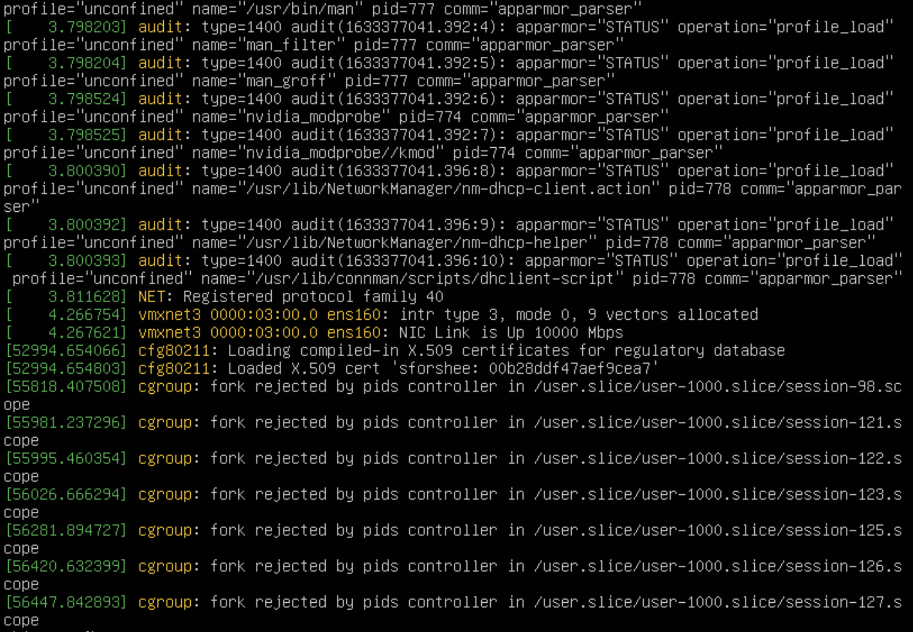

Домашнее задание к занятию «3.4. Операционные системы, лекция 2»


1.  Используя знания из лекции по systemd, создайте самостоятельно простой unit-файл для node_exporter.

* поместите его в автозагрузку,
* предусмотрите возможность добавления опций к запускаемому процессу через внешний файл (посмотрите, например, на `systemctl cat cron`),
* удостоверьтесь, что с помощью systemctl процесс корректно стартует, завершается, а после перезагрузки автоматически поднимается.

**Ответ:**
```shell
abix@osm:~$ wget https://github.com/prometheus/node_exporter/releases/download/v1.2.2/node_exporter-1.2.2.linux-amd64.tar.gz
abix@osm:~$ tar xvfz ./node_exporter-1.2.2.linux-amd64.tar.gz
abix@osm:~$ sudo cp node_exporter-1.2.2.linux-amd64/node_exporter /usr/sbin/
abix@osm:~$ sudo nano /etc/systemd/system/node_exporter.service
>>>
[Unit]
Description=Node Exporter

[Service]
User=node_exporter
EnvironmentFile=/etc/sysconfig/node_exporter
ExecStart=/usr/sbin/node_exporter $OPTIONS

[Install]
WantedBy=multi-user.target
>>>
abix@osm:~$ sudo mkdir -p /etc/sysconfig
abix@osm:~$ sudo nano /etc/sysconfig/node_exporte
>>>
OPTIONS="--collector.textfile.directory /var/lib/node_exporter/textfile_collector"
>>>
abix@osm:~$ /usr/sbin/node_exporter --help
usage: node_exporter [<flags>]

Flags:
  -h, --help                     Show context-sensitive help (also try --help-long and --help-man).
      --collector.bcache.priorityStats 
...
abix@osm:~$ sudo systemctl daemon-reload
abix@osm:~$ sudo systemctl enable node_exporter
Created symlink /etc/systemd/system/multi-user.target.wants/node_exporter.service → /etc/systemd/system/node_exporter.service.
abix@osm:~$ sudo systemctl start node_exporter
abix@osm:~$  curl http://localhost:9100/metrics
# HELP go_gc_duration_seconds A summary of the pause duration of garbage collection cycles.
# TYPE go_gc_duration_seconds summary
go_gc_duration_seconds{quantile="0"} 0
...
```

2. Ознакомьтесь с опциями node_exporter и выводом /metrics по-умолчанию. Приведите несколько опций, которые вы бы выбрали для базового мониторинга хоста по CPU, памяти, диску и сети.

**Ответ:**

CPU:
* node_cpu_seconds_total{cpu="0",mode="idle"} 2238.49
* node_cpu_seconds_total{cpu="0",mode="system"} 16.72
* node_cpu_seconds_total{cpu="0",mode="user"} 6.86
* process_cpu_seconds_total

Memory:
* node_memory_MemAvailable_bytes
* node_memory_MemFree_bytes

Disk (для каждого):
* node_disk_io_time_seconds_total{device="sda"}
* node_disk_read_bytes_total{device="sda"}
* node_disk_read_time_seconds_total{device="sda"}
* node_disk_write_time_seconds_total{device="sda"}

Network (для каждого):
* node_network_receive_errs_total{device="eth0"}
* node_network_receive_bytes_total{device="eth0"}
* node_network_transmit_bytes_total{device="eth0"}
* node_network_transmit_errs_total{device="eth0"}

3. Установите в свою виртуальную машину Netdata. Ознакомьтесь с метриками, которые по умолчанию собираются Netdata и с комментариями, которые даны к этим метрикам.

**Ответ:**
```shell
abix@osm:~$ sudo lsof -i :19999
COMMAND   PID    USER   FD   TYPE DEVICE SIZE/OFF NODE NAME
netdata 42049 netdata    4u  IPv4 298139      0t0  TCP *:19999 (LISTEN)
```
 

4. Можно ли по выводу dmesg понять, осознает ли ОС, что загружена не на настоящем оборудовании, а на системе виртуализации?

**Ответ:**
```shell
abix@osm:~$ dmesg |grep virtualiz
[    0.027384] Booting paravirtualized kernel on VMware hypervisor
[    3.097299] systemd[1]: Detected virtualization vmware.
```

5. Как настроен sysctl fs.nr_open на системе по-умолчанию? Узнайте, что означает этот параметр. Какой другой существующий лимит не позволит достичь такого числа (ulimit --help)?

**Ответ:** Это максимальное число открытых дескрипторов для ядра, для пользователя задать больше этого числа нельзя. Число кратно 1024. Мягкий лимит может быть увеличен в процессе работы системы, жесткий только уменьшен. Оба лимита не могут превысить системный fs.nr_open

```shell
abix@osm:~$ /sbin/sysctl -n fs.nr_open
1048576
abix@osm:~$ cat /proc/sys/fs/file-max
9223372036854775807
abix@osm:~$ ulimit -Sn
1024
abix@osm:~$ ulimit -Hn
1048576
```

6. Запустите любой долгоживущий процесс (не ls, который отработает мгновенно, а, например, sleep 1h) в отдельном неймспейсе процессов; покажите, что ваш процесс работает под PID 1 через nsenter. Для простоты работайте в данном задании под root (sudo -i). Под обычным пользователем требуются дополнительные опции (--map-root-user) и т.д.

**Ответ:** 

```shell
abix@osm:~$ sudo unshare -f --pid --mount-proc /bin/bash
root@osm:/home/abix# ps aux
USER         PID %CPU %MEM    VSZ   RSS TTY      STAT START   TIME COMMAND
root           1  0.0  0.0   7236  3968 pts/1    S    11:11   0:00 /bin/bash
root           8  0.0  0.0   8892  3220 pts/1    R+   11:12   0:00 ps aux
root@osm:/home/abix# sleep 1h
...
...
root@osm:~# ps -e |grep sleep
  46706 pts/1    00:00:00 sleep
root@osm:~# nsenter --target 46706 --pid --mount
root@osm:/# ps aux
USER         PID %CPU %MEM    VSZ   RSS TTY      STAT START   TIME COMMAND
root           1  0.0  0.0   7236  4048 pts/1    S    11:11   0:00 /bin/bash
root          34  0.0  0.0   5476   592 pts/1    S+   11:14   0:00 sleep 1h
root          35  0.3  0.0   8288  5236 pts/3    S    11:15   0:00 -bash
root          46  0.0  0.0   8892  3432 pts/3    R+   11:15   0:00 ps aux
```

7. Найдите информацию о том, что такое :(){ :|:& };:. Запустите эту команду в своей виртуальной машине Vagrant с Ubuntu 20.04 (это важно, поведение в других ОС не проверялось). Некоторое время все будет "плохо", после чего (минуты) – ОС должна стабилизироваться. Вызов dmesg расскажет, какой механизм помог автоматической стабилизации. Как настроен этот механизм по-умолчанию, и как изменить число процессов, которое можно создать в сессии?

**Ответ:** Это  [Fork Bomb](https://ru.wikipedia.org/wiki/Fork-%D0%B1%D0%BE%D0%BC%D0%B1%D0%B0). На скрине видно что помогло восстановиться системе, а именно принудительное ограничение количества процессов, которые пользователь может запустить одновременно.
