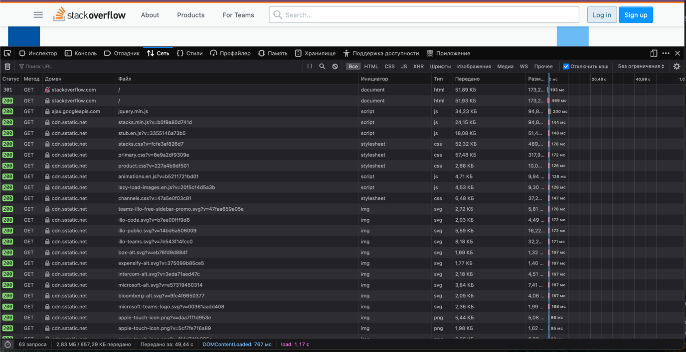

Домашнее задание к занятию "3.6. Компьютерные сети, лекция 1"

1. Работа c HTTP через телнет.
- Подключитесь утилитой телнет к сайту stackoverflow.com
  `telnet stackoverflow.com 80`
- отправьте HTTP запрос
```bash
GET /questions HTTP/1.0
HOST: stackoverflow.com
[press enter]
[press enter]
```
- В ответе укажите полученный HTTP код, что он означает?
- 
   **Ответ:** 
```shell
HTTP/1.1 301 Moved Permanently
cache-control: no-cache, no-store, must-revalidate
location: https://stackoverflow.com/questions
x-request-guid: c35a11c6-3d31-43b2-a798-91afb9e3af9e
feature-policy: microphone 'none'; speaker 'none'
content-security-policy: upgrade-insecure-requests; frame-ancestors 'self' https://stackexchange.com
Accept-Ranges: bytes
Date: Tue, 11 Jan 2022 11:34:00 GMT
Via: 1.1 varnish
Connection: close
X-Served-By: cache-hhn4041-HHN
X-Cache: MISS
X-Cache-Hits: 0
X-Timer: S1641900840.067047,VS0,VE169
Vary: Fastly-SSL
X-DNS-Prefetch-Control: off
Set-Cookie: prov=5e76cc46-64e2-f979-c702-ad952a82d823; domain=.stackoverflow.com; expires=Fri, 01-Jan-2055 00:00:00 GMT; path=/; HttpOnly

Connection closed by foreign host.
```
Ответ говорит о том, что страница перемещена на постоянной основе, новый адрес находится в заголовке location. HTTPS тут является обязательным.

2. Повторите задание 1 в браузере, используя консоль разработчика F12.
- откройте вкладку `Network`
- отправьте запрос http://stackoverflow.com
- найдите первый ответ HTTP сервера, откройте вкладку `Headers`
- укажите в ответе полученный HTTP код.
- проверьте время загрузки страницы, какой запрос обрабатывался дольше всего?
- приложите скриншот консоли браузера в ответ.

  **Ответ:** 
Полученный код `HTTP/1.1 301 Moved Permanently`.
Самый долгий запрос был `GET https://stackoverflow.com/` занял 496мс



3. Какой IP адрес у вас в интернете?

   **Ответ:** 
```shell
~$ curl http://ifconfig.co
185.75.88.249
~$ dig ANY +short @ns1-1.akamaitech.net ANY whoami.akamai.net
;; Warning, extra type option
185.75.88.249
```

4. Какому провайдеру принадлежит ваш IP адрес? Какой автономной системе AS? Воспользуйтесь утилитой `whois`

   **Ответ:** провайдер `QuickSoft LLC`, автономная система `AS62222`
```shell
~$ whois 185.75.88.249
% IANA WHOIS server
% for more information on IANA, visit http://www.iana.org
% This query returned 1 object

refer:        whois.ripe.net

inetnum:      185.0.0.0 - 185.255.255.255
organisation: RIPE NCC
status:       ALLOCATED

whois:        whois.ripe.net

changed:      2011-02
source:       IANA

# whois.ripe.net

inetnum:        185.75.88.0 - 185.75.89.255
netname:        QS-MSK
descr:          QuickSoft LLC
country:        RU
admin-c:        VA5700-RIPE
tech-c:         VA5700-RIPE
status:         ASSIGNED PA
mnt-by:         QS-MNT
created:        2015-07-07T12:36:18Z
last-modified:  2015-11-06T19:58:33Z
source:         RIPE

person:         Vladimir Andreev
address:        Gen. Glagoleva st. 30-3, apt. 409
address:        Moscow, Russia
phone:          +79031750503
nic-hdl:        VA5700-RIPE
mnt-by:         VA-MNT
created:        2014-09-23T19:40:08Z
last-modified:  2016-12-21T20:26:50Z
source:         RIPE # Filtered

% Information related to '185.75.88.0/22AS62222'

route:          185.75.88.0/22
descr:          QuickSoft LLC
origin:         AS62222
mnt-by:         QS-MNT
created:        2015-01-05T08:22:30Z
last-modified:  2015-07-14T18:27:11Z
source:         RIPE

% This query was served by the RIPE Database Query Service version 1.102.2 (WAGYU) 
```

5. Через какие сети проходит пакет, отправленный с вашего компьютера на адрес 8.8.8.8? Через какие AS? Воспользуйтесь утилитой `traceroute`

   **Ответ:**
```shell
~$ traceroute -A 8.8.8.8
traceroute to 8.8.8.8 (8.8.8.8), 30 hops max, 60 byte packets
 1  185.75.88.193 (185.75.88.193) [AS62222]  7.686 ms  8.010 ms  8.345 ms
 2  213.248.33.76 (213.248.33.76) [AS12695]  3.519 ms * *
 3  xe-7-0-3.mbr1.msk1.ip.di-net.ru (213.248.7.114) [AS12695]  4.001 ms msk-ix-gw1.google.com (195.208.208.232) [AS5480]  0.899 ms  0.888 ms
 4  108.170.250.34 (108.170.250.34) [AS15169]  2.168 ms google.ip.di-net.ru (89.208.23.215) [AS12695]  4.406 ms 108.170.250.51 (108.170.250.51) [AS15169]  1.592 ms
 5  209.85.255.136 (209.85.255.136) [AS15169]  15.840 ms 142.251.49.24 (142.251.49.24) [AS15169]  13.862 ms *
 6  172.253.66.110 (172.253.66.110) [AS15169]  19.488 ms 209.85.254.6 (209.85.254.6) [AS15169]  18.974 ms 108.170.250.129 (108.170.250.129) [AS15169]  4.038 ms
 7  108.170.250.34 (108.170.250.34) [AS15169]  3.773 ms *  2.074 ms
 8  209.85.255.136 (209.85.255.136) [AS15169]  15.838 ms * *
 9  * * *
10  * * 172.253.79.115 (172.253.79.115) [AS15169]  17.890 ms
11  * * *
12  * * *
13  * * *
14  * * *
15  * * *
16  * * *
17  * dns.google (8.8.8.8) [AS15169]  15.785 ms *
```

6. Повторите задание 5 в утилите `mtr`. На каком участке наибольшая задержка - delay?

   **Ответ:** наибольшая задержка на 13 участке.
```shell
~$ mtr -zn --report  8.8.8.8
Start: 2022-01-11T15:24:26+0300
HOST: MacBook-Pro-Dmitriy-2.local Loss%   Snt   Last   Avg  Best  Wrst StDev
  1. AS???    192.168.10.1         0.0%    10    3.5   3.4   3.0   4.1   0.4
  2. AS8595   5.101.202.53         0.0%    10    3.9   4.2   3.2   5.8   0.9
  3. AS???    10.14.14.1           0.0%    10    3.4   4.5   2.7   9.6   1.9
  4. AS8595   195.94.230.13        0.0%    10    5.2   4.4   3.2   5.9   0.8
  5. AS8595   195.94.226.121       0.0%    10    3.5   3.9   3.2   5.9   0.8
  6. AS8595   195.94.226.120       0.0%    10    5.1   4.9   3.9   6.4   0.9
  7. AS8595   195.94.226.67        0.0%    10    6.8   5.2   3.6   6.8   0.9
  8. AS8595   195.94.230.26        0.0%    10    6.1   5.7   4.9   6.9   0.6
  9. AS15169  108.170.250.33       0.0%    10    5.2   5.8   5.1   6.7   0.6
 10. AS15169  108.170.250.51      20.0%    10    5.4   4.6   3.2   5.4   0.6
 11. AS15169  142.251.49.158      30.0%    10   20.5  20.7  19.7  21.8   0.6
 12. AS15169  216.239.43.20        0.0%    10   20.9  20.6  19.8  22.6   0.8
 13. AS15169  172.253.51.187       0.0%    10   22.6  22.4  21.0  23.4   0.8
 14. AS???    ???                 100.0    10    0.0   0.0   0.0   0.0   0.0
 15. AS???    ???                 100.0    10    0.0   0.0   0.0   0.0   0.0
 16. AS???    ???                 100.0    10    0.0   0.0   0.0   0.0   0.0
 17. AS???    ???                 100.0    10    0.0   0.0   0.0   0.0   0.0
 18. AS???    ???                 100.0    10    0.0   0.0   0.0   0.0   0.0
 19. AS???    ???                 100.0    10    0.0   0.0   0.0   0.0   0.0
 20. AS???    ???                 100.0    10    0.0   0.0   0.0   0.0   0.0
 21. AS???    ???                 100.0    10    0.0   0.0   0.0   0.0   0.0
 22. AS???    ???                 100.0    10    0.0   0.0   0.0   0.0   0.0
 23. AS15169  8.8.8.8              0.0%    10   20.6  20.3  19.7  21.4   0.5
```

7. Какие DNS сервера отвечают за доменное имя dns.google? Какие A записи? воспользуйтесь утилитой `dig`

   **Ответ:**
```shell
~$ dig dns.google NS +noall +answer          

; <<>> DiG 9.10.6 <<>> dns.google NS +noall +answer
;; global options: +cmd
dns.google.		21600	IN	NS	ns1.zdns.google.
dns.google.		21600	IN	NS	ns2.zdns.google.
dns.google.		21600	IN	NS	ns3.zdns.google.
dns.google.		21600	IN	NS	ns4.zdns.google.
~$ dig dns.google A +noall +answer

; <<>> DiG 9.10.6 <<>> dns.google A +noall +answer
;; global options: +cmd
dns.google.		660	IN	A	8.8.8.8
dns.google.		660	IN	A	8.8.4.4
```

8. Проверьте PTR записи для IP адресов из задания 7. Какое доменное имя привязано к IP? воспользуйтесь утилитой `dig`

   **Ответ:**
```shell
~$ dig -x 8.8.8.8  +noall +answer

; <<>> DiG 9.10.6 <<>> -x 8.8.8.8 +noall +answer
;; global options: +cmd
8.8.8.8.in-addr.arpa.	6814	IN	PTR	dns.google.
~$ dig -x 8.8.4.4  +noall +answer

; <<>> DiG 9.10.6 <<>> -x 8.8.4.4 +noall +answer
;; global options: +cmd
4.4.8.8.in-addr.arpa.	6392	IN	PTR	dns.google.
```