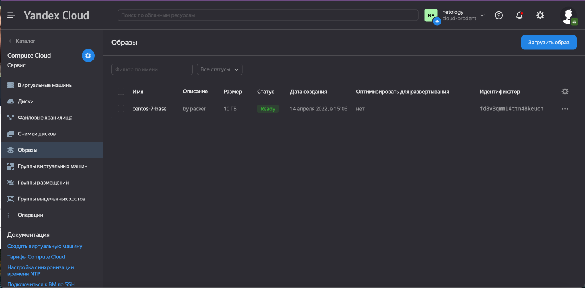
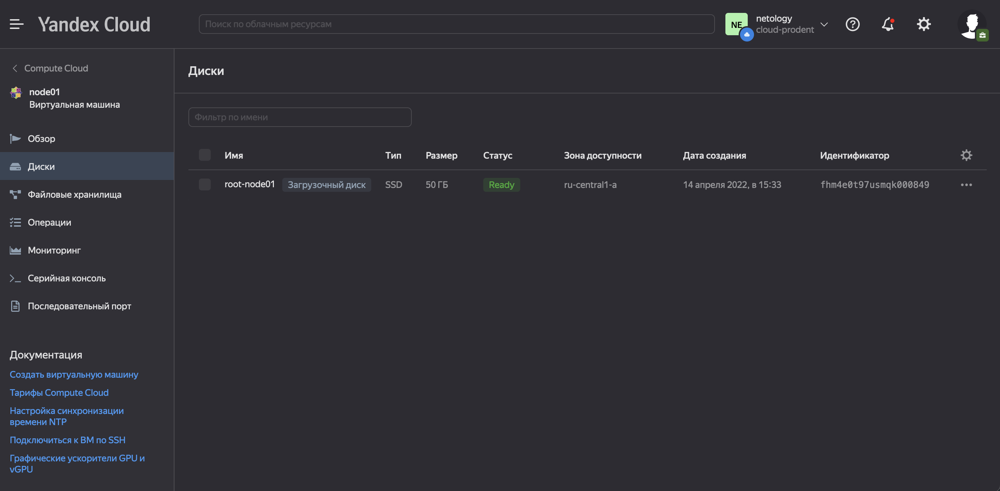
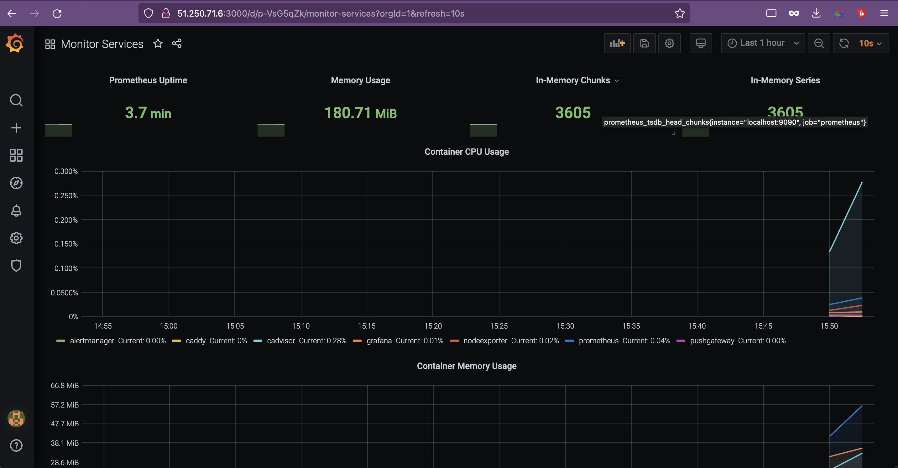

# Домашнее задание к занятию "5.4. Оркестрация группой Docker контейнеров на примере Docker Compose"
## Задача 1

<details>
<summary> </summary>

> Создать собственный образ операционной системы с помощью Packer.
>
> Для получения зачета, вам необходимо предоставить:
> - Скриншот страницы, как на слайде из презентации (слайд 37).

</details>

```shell
❯ yc compute image list
+----------------------+---------------+--------+----------------------+--------+
|          ID          |     NAME      | FAMILY |     PRODUCT IDS      | STATUS |
+----------------------+---------------+--------+----------------------+--------+
| fd8v3qmm14ttn48keuch | centos-7-base | centos | f2esd9f5o5i9p7pkkk8k | READY  |
+----------------------+---------------+--------+----------------------+--------+

```




<details>
<summary> </summary>

> Создать вашу первую виртуальную машину в Яндекс.Облаке.
>
> Для получения зачета, вам необходимо предоставить:
> - Скриншот страницы свойств созданной ВМ, как на примере

</details>




## Задача 3

<details>
<summary>.</summary>

> Создать ваш первый готовый к боевой эксплуатации компонент мониторинга, состоящий из стека микросервисов.
>
> Для получения зачета, вам необходимо предоставить:
> - Скриншот работающего веб-интерфейса Grafana с текущими метриками

</details>



